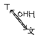

# OHH
这套工具帮助你非侵入式的翻译简单的小众项目。

它极易扩展，并通过一套简单的标准进行聚合。它包含一套较为人性化的编程方法，让你用尽可能少的代码和尝试次数就能做到很多本地化的需求。  

该项目允许您在二进制目标（而不是源代码）上执行某些操作，这极大地简化了初级本地化过程。例如，您不需要为目标运行完整的编译过程。

您可以轻松扩展该项目并将其附加到 [本仓库](github.com/duoduo70/ohh).

## How to use
您需要一个 Python3 运行时。之后，只需将 `ohh` 子目录作为 python 模型导入即可。   
例如：
```python
from ohh import *

for_dir("test.txt").write("OHH")
```

您可以发布示例并将其附加到此存储库。

我将在第一个正式版本之后推送新的示例。

你可以通过很简单的方法扩展该项目，通常来说，是把你的扩展塞进 `ohh/modules` 目录，然后更改 `ohh/modules/__init__.py`
我们先声明我们要对哪个文件或目录进行操作，然后将指定操作作用于它。  
这样，我们便可一目了然于对哪些文件或目录进行过操作。

欲获得更多信息，请查看[教程](Tutorial.md)，它应该能覆盖所有信息。